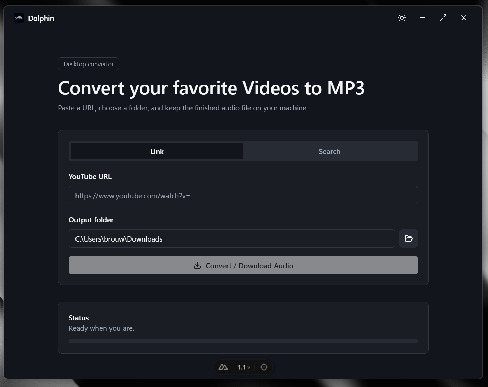
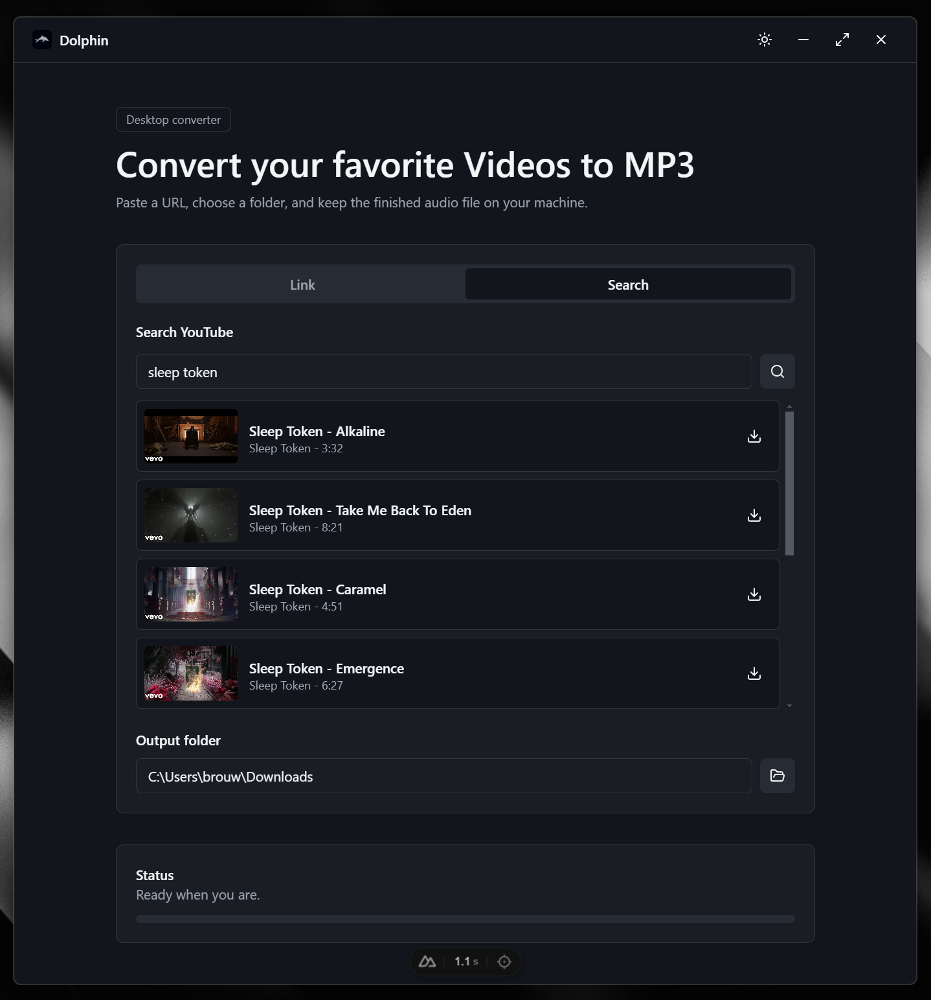
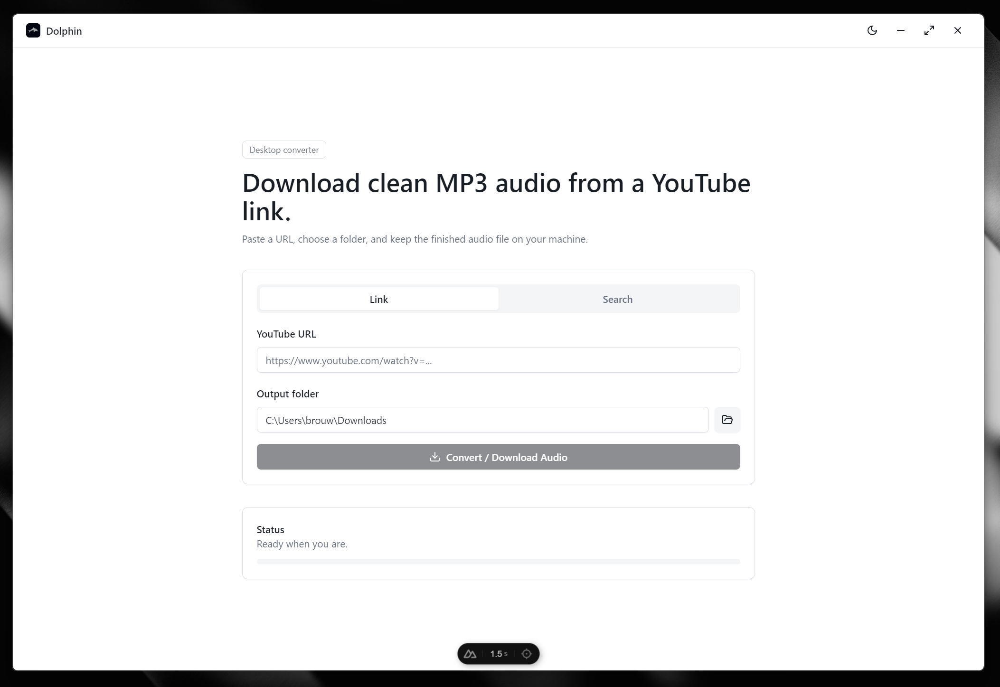
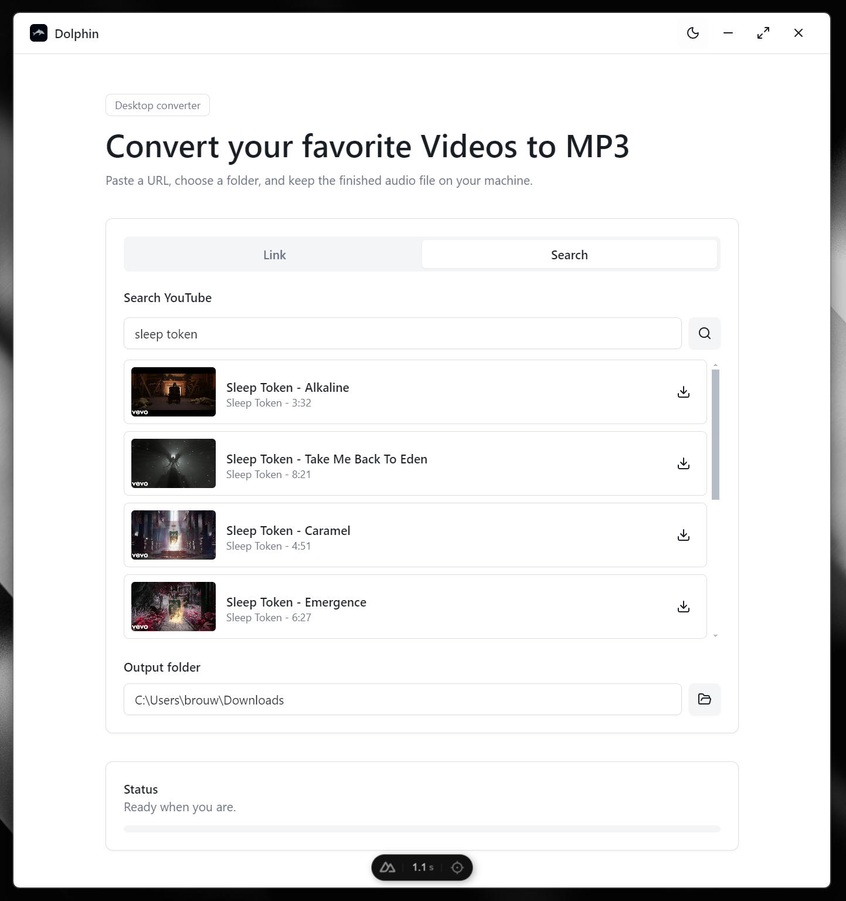

# Dolphin  

Dolphin is a small desktop media utility for saving audio from supported online video links and search results. It wraps a Nuxt interface in Electron, keeps the workflow local, and lets you choose where the finished file lands on your machine.

The app is intentionally simple: paste a link or search from inside the app, choose an output folder, and start the job. Dolphin shows progress while it fetches the source audio and, when the required audio tools are available, converts it into an MP3.

Use Dolphin only with media you own, have permission to archive, or are otherwise allowed to save under the source platform's terms.

## Preview

### Dark Mode


  
### Light Mode




## Requirements

- Node.js and npm
- `ffmpeg` and `ffprobe` available on `PATH` for MP3 conversion

Dolphin checks for `ffmpeg` and `ffprobe` before each job. If both are found, it saves an MP3. If they are not available, Dolphin falls back to saving the best source audio stream instead, which will usually be a `.webm` file.

On Windows, install FFmpeg and make sure the folder containing `ffmpeg.exe` and `ffprobe.exe` is added to your system `PATH`. Open a new terminal and verify it with:

```bash
ffmpeg -version
ffprobe -version
```

## Install

```bash
npm install
```

## Development

Run the full desktop app in development mode:

```bash
npm run dev
```

This starts Nuxt on `http://127.0.0.1:3000` and opens Electron against that local dev server.

Run only the web UI:

```bash
npm run dev:web
```

Generate the Nuxt output and launch Electron against the generated files:

```bash
npm run generate
npm run start
```

## Build

Create an unpacked Electron build:

```bash
npm run pack
```

Create a Windows portable build:

```bash
npm run dist
```

Create a Windows installer:

```bash
npm run dist:installer
```

Build artifacts are written to `release/`.

## Tech Stack

- Nuxt 3 and Vue 3
- Electron
- Tailwind CSS
- shadcn-style local components
- `youtube-dl-exec` for media metadata and retrieval
- System `ffmpeg` / `ffprobe` for MP3 conversion
